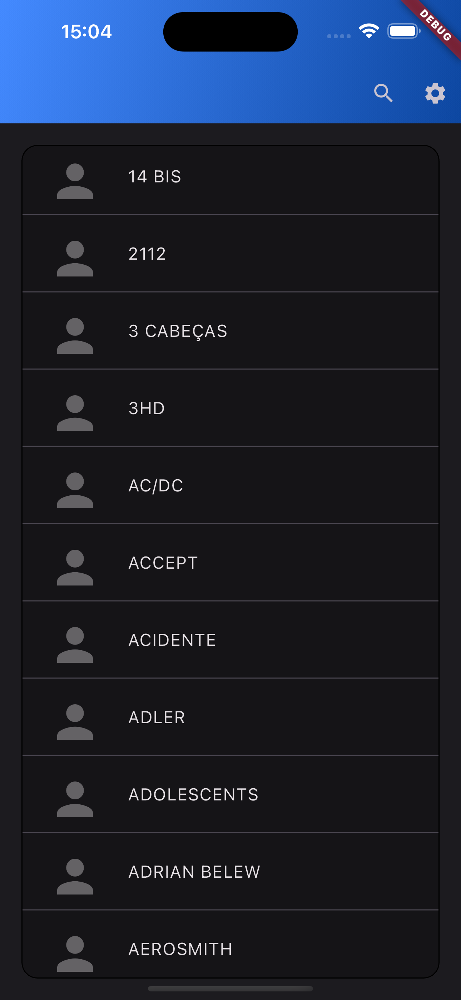
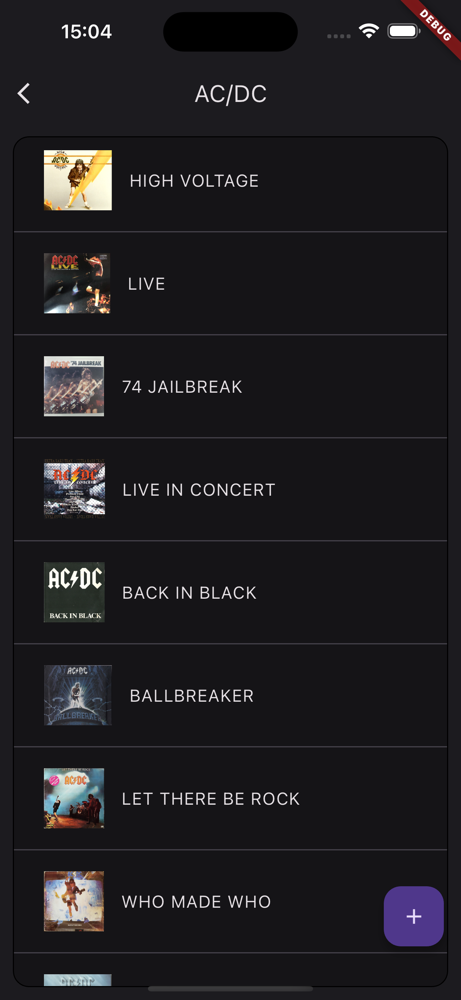
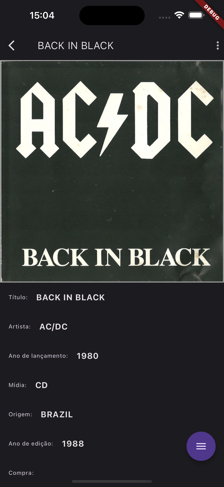

# Music Application

This is a music application built using Flutter. It allows users to listen to their favorite songs, create playlists, and discover new music.

## Features

- Browse and search for albuns
- Play albuns on Spotify

## Installation

1. Clone the repository:

    ```bash
    git clone https://github.com/gabrieloliveira95/music-app.git
    ```

2. Change to the project directory:

    ```bash
    cd music-app
    ```

3. Install dependencies:

    ```bash
    flutter pub get
    ```

4. Add .env file in assets folder

    ```bash
    echo \
    OAUTH_CLIENT_ID= \
    OAUTH_CLIENT_SECRET= \
    OAUTH_AUDIENCE= \
    OAUTH_DOMAIN= \
    API_DOMAIN= \
    DISCOGS_TOKEN= \
    >> assets/.env
    ```

4. Run the application:

    ```bash
    flutter run
    ```

## Screenshots

Artists Screen            |  Artists Albuns Screeen          |  Album Details Screen
:-------------------------:|:-------------------------:| :-------------------------:
  |   | 

## Contributing

Contributions are welcome! If you find any bugs or have suggestions for new features, please open an issue or submit a pull request.

## License

This project is licensed under the [MIT License](LICENSE).

## Acknowledgements

- [Flutter](https://flutter.dev/)
- [Flutter Packages](https://pub.dev/flutter/packages)
- [Icons8](https://icons8.com/)

